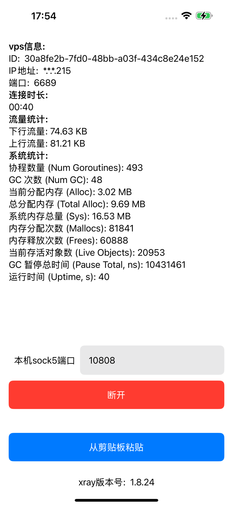

# xray核心的ios例子
实现了最基础的功能，安装以后首次使用需要从别的地方复制配置，类似 **vless://id@ip:port?security=none&encryption=none&type=tcp** 这样的链接，然后从剪切板粘贴进来，配置会保存到 **UserDefaults**，再次使用的时候直接点击连接就可以

## 界面

## 测试机型
我只有 iphone 15 plus，测试了 ios 17.6.1 和 18